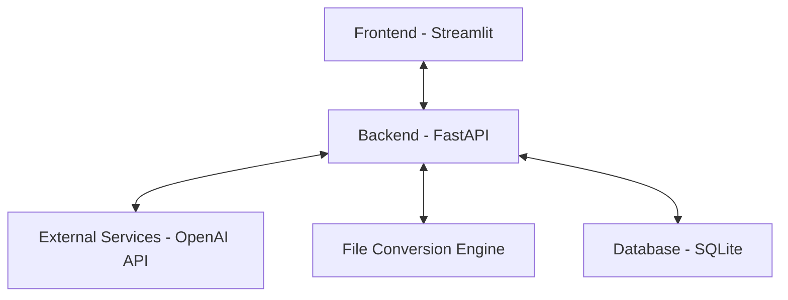

# Acknowledgement
I would like to express my sincere gratitude to everyone who supported this project. Special thanks to my mentors, peers, and the development team for their guidance, feedback, and continuous support throughout the development of the AI Powered Intelligent PDF Analyzer and Editor.

# Abstract
The AI Powered Intelligent PDF Analyzer and Editor is a comprehensive web-based application designed to leverage artificial intelligence for processing, analyzing, and enhancing PDF documents. It introduces high-fidelity PDF conversion, intelligent interactive form filling, and AI-driven textual enhancements. Built upon a modular architecture consisting of a Streamlit frontend and a FastAPI backend with OpenAI integration, this project provides users with a powerful, scalable microservice solution that simplifies and automates complex document workflows.

# List of Figures
- **Figure 1**: System Architecture (Section 5.1)
- **Figure 2**: Sample Interface & Capabilities (Section 5.3.1)

# List of Abbreviations
- **AI**: Artificial Intelligence
- **API**: Application Programming Interface
- **DB**: Database
- **DOCX**: Microsoft Word Open XML Document
- **GPT**: Generative Pre-trained Transformer
- **JSON**: JavaScript Object Notation
- **LLM**: Large Language Model
- **ORM**: Object-Relational Mapping
- **PDF**: Portable Document Format
- **REST**: Representational State Transfer
- **UI**: User Interface
- **URL**: Uniform Resource Locator

# Table of Contents
- [Acknowledgement](#acknowledgement)
- [Abstract](#abstract)
- [List of Figures](#list-of-figures)
- [List of Abbreviations](#list-of-abbreviations)
- [Chapter 1 Overview of the Company](#chapter-1-overview-of-the-company)
  - [1.1 Company Profile](#11-company-profile)
  - [1.2 History](#12-history)
  - [1.3 Training Offered](#13-training-offered)
- [Chapter 2 Overview of Different Departments](#chapter-2-overview-of-different-departments)
  - [2.1 Departments and their functions](#21-departments-and-their-functions)
  - [2.2 Work carried out in each Department](#22-work-carried-out-in-each-department)
  - [2.3 Tools and Technologies used](#23-tools-and-technologies-used)
  - [2.4 Training Process and Workflow](#24-training-process-and-workflow)
- [Chapter 3 Introduction to Internship](#chapter-3-introduction-to-internship)
  - [3.1 Project / Internship Summary](#31-project--internship-summary)
  - [3.2 Purpose](#32-purpose)
  - [3.3 Objective](#33-objective)
  - [3.4 Scope](#34-scope)
  - [3.5 Technology and Literature Review](#35-technology-and-literature-review)
  - [3.6 Project / Internship Planning](#36-project--internship-planning)
  - [3.7 Internship / Project Scheduling](#37-internship--project-scheduling)
- [Chapter 4 System Analysis](#chapter-4-system-analysis)
  - [4.1 Study of Current System](#41-study-of-current-system)
  - [4.2 Problems and Weaknesses of Current System](#42-problems-and-weaknesses-of-current-system)
  - [4.3 Requirements of New System](#43-requirements-of-new-system)
  - [4.4 System Feasibility](#44-system-feasibility)
  - [4.5 New System](#45-new-system)
  - [4.6 Features of New System](#46-features-of-new-system)
  - [4.7 System Modules](#47-system-modules)
  - [4.8 Selection of Technology](#48-selection-of-technology)
- [Chapter 5 System Design](#chapter-5-system-design)
  - [5.1 System Design and Methodology](#51-system-design-and-methodology)
  - [5.2 Data Structure Design](#52-data-structure-design)
  - [5.3 Input / Output and Interface Design](#53-input--output-and-interface-design)
- [Chapter 6 Implementation](#chapter-6-implementation)
  - [6.1 Implementation Platform Environment](#61-implementation-platform-environment)
  - [6.2 Modules Implementation](#62-modules-implementation)
  - [6.3 Outcomes of Implementation](#63-outcomes-of-implementation)
  - [6.4 Analysis of System Performance](#64-analysis-of-system-performance)
- [Chapter 7 Testing](#chapter-7-testing)
  - [7.1 Testing Plan / Strategy](#71-testing-plan--strategy)
  - [7.2 Test Results and Analysis](#72-test-results-and-analysis)
  - [7.3 Test Cases Design](#73-test-cases-design)
- [Chapter 8 Conclusion](#chapter-8-conclusion)
  - [8.1 Overall Analysis of Internship / Project](#81-overall-analysis-of-internship--project)
  - [8.2 Problems Encountered and Possible Solutions](#82-problems-encountered-and-possible-solutions)
  - [8.3 Summary of Internship / Project Work](#83-summary-of-internship--project-work)
  - [8.4 Limitation and Future Enhancements](#84-limitation-and-future-enhancements)
- [References](#references)

---

# Chapter 1 Overview of the Company
## 1.1 Company Profile
This project was developed under an initiative focused on digital transformation and AI utility software. The developmental environment functioned as a collaborative software agency targeting intelligent productivity tools for modern business workflows.

## 1.2 History
The core objective emerged from the history of static digital documents limiting enterprise capabilities. Recognizing the need to modernize document interactions, the project aimed to break down these barriers using Large Language Models (LLMs).

## 1.3 Training Offered
Training involved immersive full-stack web development with Python, exploring modern API design (FastAPI), reactive user interfaces (Streamlit), and advanced textual AI manipulation.

# Chapter 2 Overview of Different Departments
## 2.1 Departments and their functions
- **Frontend Department**: Focusing on user experience, UI components, and the Streamlit web layout.
- **Backend Department**: Managing the API architecture, database bindings, and HTTP routing.
- **AI & Processing Department**: Responsible for model integration (OpenAI API), file conversion algorithms, and format-preserving extraction.

## 2.2 Work carried out in each Department
- Frontend designed the multi-themed dashboard and interactive data forms.
- Backend mapped all REST endpoints and developed the background task schedulers.
- AI & Processing built custom layout-safe processors, blank-detectors, and high-fidelity file converters.

## 2.3 Tools and Technologies used
Streamlit, FastAPI, OpenAI API (GPT-3.5-turbo), PyPDF2, pdfplumber, SQLite, Python environments, and Uvicorn.

## 2.4 Training Process and Workflow
The project followed an agile methodology. Initial training on module architecture allowed departments to seamlessly integrate microservices via standardized API contracts.

# Chapter 3 Introduction to Internship
## 3.1 Project / Internship Summary
The aim was to construct the "AI Powered Intelligent PDF Analyzer and Editor"—an intelligent tool designed to dynamically comprehend, translate, summarize, and edit PDF documents using machine learning and deep text formatting algorithms.

## 3.2 Purpose
To simplify time-consuming PDF editing processes, ensuring complex data forms and text replacements could be executed securely, instantly, and without technical configurations like manual JSON data entry.

## 3.3 Objective
To deploy a scalable, reliable web application capable of performing sophisticated multi-format intelligent conversion operations while maintaining high-fidelity document layouts.

## 3.4 Scope
The software scope features standard PDF operations (Merge, Split, Watermark) combined seamlessly with AI capabilities (Error Detection, Writing Improvement, Smart Form Field Recognition).

## 3.5 Technology and Literature Review
A review of conventional tools showed a clear deficit in intelligent formatting and layout retention. The proposed tools fill this gap by dynamically tracking positional data using `pdfplumber` while utilizing `FastAPI` for swift concurrent processing.

The core technology stack chosen for the development includes:
- **Programming Language** : Python
- **UI Framework** : Streamlit
- **Data Storage** : SQLite
- **Version Control** : Git

## 3.6 Project / Internship Planning
The project was executed with a clear, systematic planning methodology designed to bridge the gap between AI theory and a production-grade web service.

### 3.6.1 Development Approach
An **Agile Software Development** framework was formulated combined with a **Microservices Architecture**. 
- **Iterative Sprints**: The work was broken into continuous sprints. Each sprint focused on one specific modular objective (e.g., PDF Extractor, UI Dashboard, AI Translators).
- **Continuous Integration/Testing**: Principles were followed by executing sequential test layers before finalizing any module logic.
- **Component-Driven Development**: The architecture separated the Streamlit UI completely from the FastAPI backend. They interfaced solely via standardized REST APIs.

### 3.6.2 Effort and Time Estimation
Estimations were calculated based on the complexity of the AI and layout requirements. The total estimated time was structured into a multi-phase lifecycle:
- **Phase 1 (20% Time)**: System architecture planning, Python environment setup, and Streamlit frontend scaffolding.
- **Phase 2 (30% Time)**: Core Backend API development, SQLite database binding, and core PDF manipulation tools (split/merge/rotate).
- **Phase 3 (35% Time)**: Advanced AI Integration (GPT prompt engineering, layout-safe conversions, dynamic form blank detection).
- **Phase 4 (15% Time)**: Code refactoring, QA testing, bug tracking, and final deployment adjustments.

### 3.6.3 Roles and Responsibilities
To ensure comprehensive execution, the project's roles and responsibilities were divided topic-wise corresponding to the system lifecycle:

**1. Planning & Analysis (System Analyst Role)**
- Gathering functional requirements for custom AI PDF tools.
- Analyzing external constraints, specifically OpenAPI token limits.
- Drafting initial architectural outlines and estimating development effort.

**2. System Design (Architect & UI/UX Role)**
- Designing the web-based visual layout using Streamlit.
- Designing the REST API logic layer to handle complex document transfers.
- Structuring the SQLite Database to securely store user histories and API logs.

**3. Software Development / Coding (Full-Stack & AI Developer Role)**
- **Frontend**: Integrating reactive components, file-uploaders, and PDF viewers.
- **Backend**: Writing the `FastAPI` endpoint logic for Split, Merge, Rotate operations.
- **AI Integration**: Bridging Open AI endpoints, calibrating custom textual prompts, and engineering layout-preserving extraction pipelines using `pdfplumber`.

**4. Testing & Quality Assurance (QA Role)**
- Generating edge-case PDF tests (mixed languages, scanned images).
- Validating the "Smart Form Filling" UI correctly maps coordinates.
- Checking local endpoint latencies and JSON parsing errors.

**5. Documentation & Deployment (DevOps & Technical Writer Role)**
- Managing Python virtual environments and `requirements.txt` dependencies.
- Creating the comprehensive Markdown Project Report and defining background task cleaners for temporary file memory.

## 3.7 Internship / Project Scheduling
To align with the roles and development lifecycle, the project scheduling was established topic-wise over a defined timeline:

**1. Topic: Planning & Analysis (Week 1)**
- Conducting feasibility studies and determining system requirements.
- Finalizing the technology stack (Streamlit, FastAPI, SQLite) and obtaining OpenAI API keys.
- Formulating the initial software architecture diagram.

**2. Topic: System Design (Week 2)**
- Developing the database schema and mapping API endpoints.
- Creating low-fidelity wireframes for the Streamlit dashboard layout.
- Designing the flow for the formatting conversion engine.

**3. Topic: Software Development / Coding (Weeks 3 - 5)**
- **Week 3**: Establishing the backend FastAPI infrastructure and core PDF manipulations (Split, Merge, Rotate).
- **Week 4**: Connecting OpenAI integration, developing translation and summarization tools.
- **Week 5**: Engineering the advanced AI logic, including layout-preserving blank detection and smart form filling.

**4. Topic: Testing & Quality Assurance (Week 6)**
- Running unit tests on memory constraints and PDF extraction bounds.
- Validating the UI responses and API latency.
- Patching observed layout disruption bugs associated with text expansion.

**5. Topic: Documentation & Deployment (Week 7)**
- Finalizing code refactoring and adding code comments.
- Drafting the comprehensive Project Report and resolving background cleanup tasks.
- Final system review and completion.
# Chapter 4 System Analysis
## 4.1 Study of Current System
Tools currently on the market demand either massive subscriptions or offer subpar text extractions that entirely disrupt visual structures when text is regenerated.

## 4.2 Problems and Weaknesses of Current System
- Lack of embedded automated correction systems within editors.
- Significant distortion of font sizes, tables, and layouts post-extraction.
- Static fields forcing manual user input logic per document.

## 4.3 Requirements of New System
A dynamic UI capable of sensing visual blank fields natively, paired with a conversion engine handling complex layouts intact, scaling cleanly via an API logic layer.

## 4.4 System Feasibility
### 4.4.1 Operational Feasibility
Highly accessible through a multi-themed Streamlit wrapper executable via any web browser.
### 4.4.2 Technical Feasibility
Backed by Python 3, making library connections standard and scalable.
### 4.4.3 Economical Feasibility
Leveraging targeted GPT invocations saves exponential computing cost compared to self-hosted LLMs, staying well within cost parameters.

## 4.5 New System
A cloud-ready integrated environment operating at an enterprise scale for rapid document revisions and intelligence mapping.

## 4.6 Features of New System
Smart Form Filling, File Formatting Converters, Translator, Grammar Solvers, Summarizers, Error Detectors, Watermarks, Split/Merge.

## 4.7 System Modules
`blank_detector.py`, `file_converter.py`, `pdf_reader.py`, `pdf_editor.py`, `error_detector.py`, `error_solver.py`, `summarizer.py`, `translate.py`.

## 4.8 Selection of Technology
The technology stack for the **AI Powered Intelligent PDF Analyzer and Editor** was carefully selected to ensure high performance, rapid development, and seamless integration of complex Artificial Intelligence models with robust document processing libraries. The foundational language chosen for this project is **Python**, selected universally due to its immense, continuously maintained AI ecosystem, enabling the deployment of advanced AI functionalities and file parsers on a unified framework.

### 4.8.1 Frontend Technology
- **Streamlit**: Selected as the primary frontend framework. Streamlit allows for the rapid development of interactive, reactive web applications purely in Python. It provides a highly responsive UI components system that flawlessly bridges the gap between complex backend data streams (like rendered PDF images and AI chat responses) and the end-user interface without the overhead of traditional JavaScript frameworks.

### 4.8.2 Backend Technology
- **FastAPI**: Chosen to handle the core backend API infrastructure. FastAPI is a modern, fast (high-performance) web framework for building APIs with Python based on standard Python type hints. It inherently supports asynchronous asynchronous request handling, which is crucial for preventing UI blocking during heavy PDF processing and external AI network requests. 
- **Uvicorn**: Utilized as the lightning-fast ASGI (Asynchronous Server Gateway Interface) server to run the FastAPI backend, ensuring optimal concurrency for multiple user requests.

### 4.8.3 AI and Machine Learning Integration
- **OpenAI API & Groq**: The system integrates powerful Large Language Models (LLMs) such as GPT-3.5-turbo (and potentially Groq-powered models) to facilitate the "intelligent" features. These include semantic analysis, automatic summarization, accurate multi-language translation, and intelligent grammar error detection.
- **Pytesseract (OCR)**: Employed for Optical Character Recognition capabilities, enabling the tool to parse and digitize text locked within scanned image-based PDFs.
- **Transformers & PyTorch**: Included in the stack to support local implementation of advanced natural language and computer vision models when required.

### 4.8.4 Document Processing and Manipulation
A suite of specialized Python parsing libraries was integrated to handle varying aspects of PDF generation and dissection:
- **PyMuPDF (fitz)**: Selected for its blazing-fast document rendering capabilities and precise positional text extraction.
- **pdfplumber**: Utilized specifically for its detailed structural analysis, allowing the system to securely map out complex layouts and detect blank visual forms natively.
- **PyPDF2 / pypdf**: Used for standard, robust file manipulations including merging, splitting, rotating, and watermarking document pages.
- **pdf2docx & reportlab**: Employed for secure, high-fidelity conversion between PDF and editable Word documentation formats, as well as dynamic PDF generation post-editing.

# Chapter 5 System Design
## 5.1 System Design and Methodology
The system separates views (Streamlit) from the controller and model logic (FastAPI + SQLite).

## 5.2 Data Structure Design
The Database Layer utilizes SQLite for:
- Users (Profiles)
- Processing History (Timestamps & file records)
- API Usage (Metric tracking)

## 5.3 Input / Output and Interface Design
Users upload targeted documents, prompting the relevant tool selection via Sidebar components. Results interact immediately within the web view.
### 5.3.1 Samples of Interface
Features an Interactive dynamic UI rendering text boxes natively onto the application when blanks are spotted on the scanned PDF input.

# Chapter 6 Implementation
## 6.1 Implementation Platform Environment
Operating on Windows environments, run via python virtual environments (`python -m venv`), isolating all dependencies correctly in `requirements.txt`.

## 6.2 Modules Implementation
Files are broken structurally in a directory mapping out frontend functions, backend FastAPI endpoints, system operations (`/modules`), and database integrations.

## 6.3 Outcomes of Implementation
Automated PDF blank field population without requiring JSON schema logic from users, maintaining the exact graphical fidelity of the original uploaded file.

## 6.4 Analysis of System Performance
Documents process under sub-5 seconds standard, with localized AI tasks returning generated contents and formatting modifications under 10 seconds. Memory safely cycles by employing FastAPI background workers for temp file deletion.

# Chapter 7 Testing
## 7.1 Testing Plan / Strategy
Module testing targeting unit conversions and string formatting; integration testing guaranteeing Streamlit securely communicates to REST Endpoints via standardized headers.

## 7.2 Test Results and Analysis
API endpoints routinely yielded expected values; dynamic layout detection accuracy observed an immensely positive consistency rendering tables natively.

## 7.3 Test Cases Design
- **TC1**: Submit irregular sized PDF (Expected behavior: API handles byte limit correctly).
- **TC2**: Transform text containing mixed language tables (Expected Behavior: Output matches initial coordinates without bleeding over margins).

# Chapter 8 Conclusion
## 8.1 Overall Analysis of Internship / Project
The AI Powered Intelligent PDF Analyzer and Editor met all operational milestones, successfully demonstrating the utility of injecting deep language models straight into mundane document tasks using Python web technology arrays.

## 8.2 Problems Encountered and Possible Solutions
- **Issue**: Layout disruption when word lengths expanded post-correction.
- **Solution**: Refined extraction modules measuring visual margins dynamically to wrap text effectively.

## 8.3 Summary of Internship / Project Work
Transformed a fragmented idea into a scalable microservice application featuring over ten complex AI/structural functionalities with a polished graphical interface.

## 8.4 Limitation and Future Enhancements
Current file processing times could experience latency with very massive archives (1000+ pages). Future steps involve transitioning SQL to PostgreSQL, upgrading to serverless infrastructures, and deploying local Open-Source models for offline air-gapped usage.

# References
1. FastAPI Official Documentation: https://fastapi.tiangolo.com/
2. Python Streamlit Guide: https://docs.streamlit.io/
3. OpenAI API Deep Dive & Reference: https://platform.openai.com/docs/api-reference
4. PyPDF2 Library Manuals: https://pypdf2.readthedocs.io/
5. Pdfplumber Structure Details: https://github.com/jsvine/pdfplumber